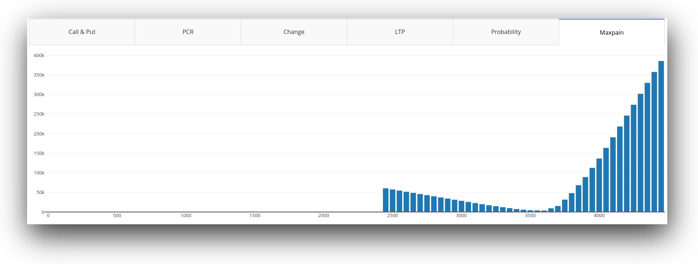
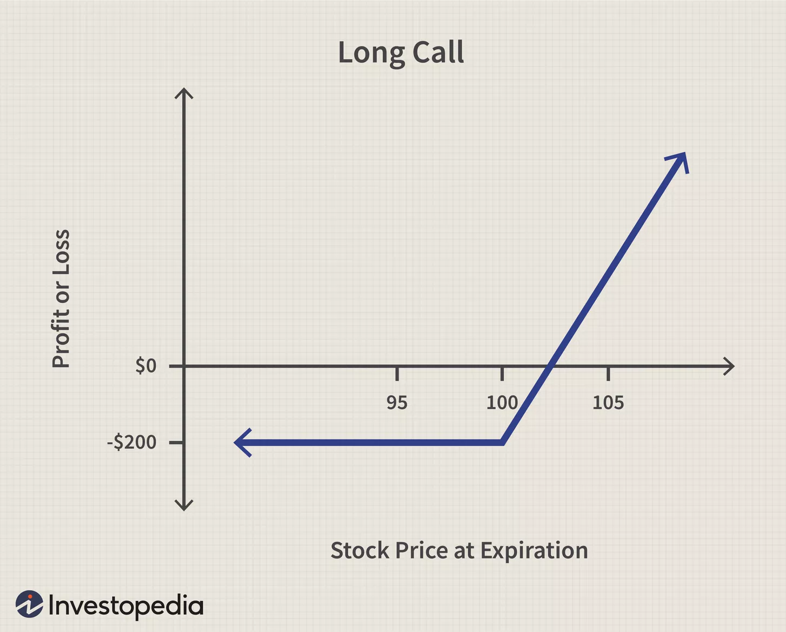
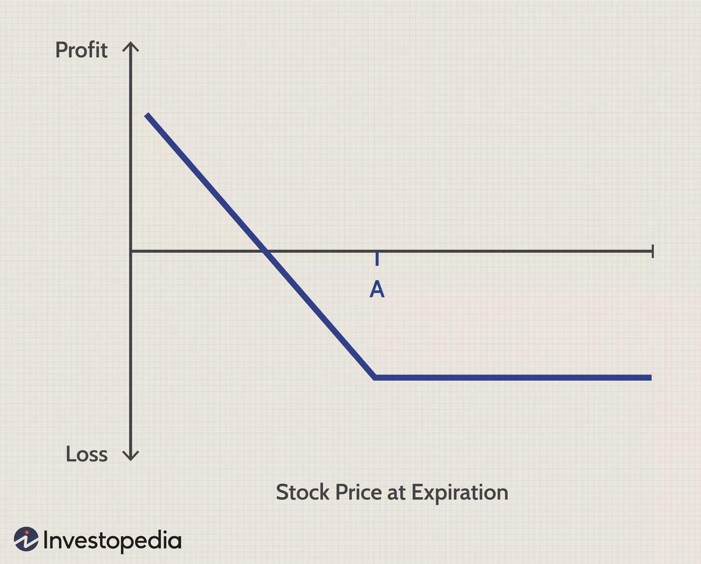
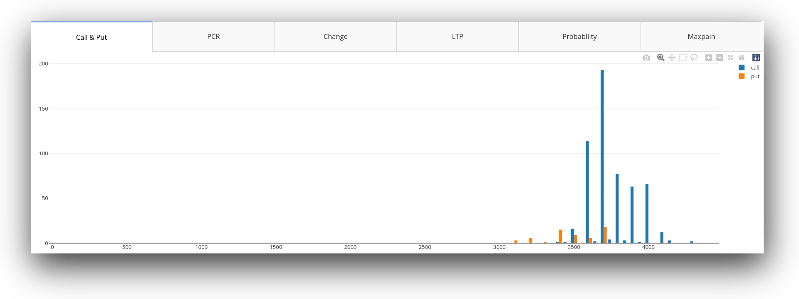
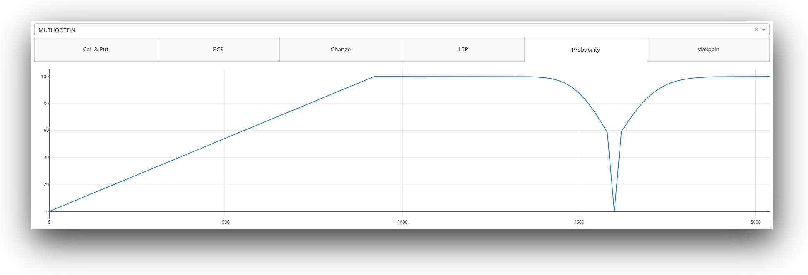

# Appendix {-}


\tableofcontents
\listoffigures

\newpage


\Begin{multicols}{2}
# Introduction 
**YASP optionchain visualiser**  is a collection of multiple technologies: **Python** as the programming language, **Bash** as a scripting language, **JSON** as a database, **Flask** as a software-based server, **Raspberry Pi** as hardware and **Arch Linux**[^1] as operating system and setup environment .

Using web-scraping we extract data from NSE [^2] which gets saved in database (as json file) then using matplotlib in first varient and dash(component in plotly [^plotty]) we generate static pngs and interactive graphs.

## Mechanism 
Both **varients**[^v] of this project scrape **NSE**[^2] to collect relevant data about user provieded stocks or all the public stocks listed on the exchange.


After this is done, the collected json data is add to *data* subdirectory and named as *stockname*-fno.json, this collected json data is used to generate png graphs and present interactive dash using plotly , served through a flask web server.This process is completly done on a Raspberry Pi 4, hence can be used to achive a headless server which does automated run of this script at fixed intervals 24x7.


# Propose work

## Probability by normal distribution

Implied volatility is *not* directly observable, so it needs to be solved using the five other inputs of the Black-Scholes model, which are:

* The market price of the option.
* The underlying stock price.
* The strike price.
* The time to expiration.
* The risk-free interest rate.

### Market Price
The **market** **price** is the current price at which an asset or service can be bought or sold. The market price of an asset or service is determined by the forces of supply and demand. The price at which quantity supplied equals quantity demanded is the market price.


Shocks to either the supply or the demand for a good or service can cause the market price for a good or service to change. A **supply** **shock** is an unexpected event that suddenly changes the supply of a good or service. A demand shock is a sudden event that increases or decreases the demand for a good or service. Some examples of supply shock are interest rate cuts, tax cuts, government stimulus, terrorist attacks, natural disasters, and stock market crashes. Some examples of demand shock include a steep rise in oil and gas prices or other commodities, political turmoil, natural disasters, and breakthroughs in production technology.

### Strike Price
A **strike** **price** is the set price at which a derivative contract can be bought or sold when it is exercised. For call options, the strike price is where the security can be bought by the option holder; for put options, the strike price is the price at which the security can be sold.


Strike prices are used in derivatives (mainly options) trading. Derivatives are financial products whose value is based (derived) on the underlying asset, usually another financial instrument. The strike price is a key variable of call and put options. For example, the buyer of a call option would have the right, but not the obligation, to buy the underlying security in the future at the specified strike price.

\End{multicols}

## Black-Scholes
Implied volatility is calculated by taking the market price of the option, entering it into the **Black-Scholes** **formula**, and back-solving for the value of the volatility. But there are various approaches to calculating implied volatility. One simple approach is to use an iterative search, or trial and error, to find the value of implied volatility.
Iv calculation done by nse

> Call IV :: call implied volatility (given by nse)
> put IV :: put option implied volatility (given by nse)
> Days of expiry :: expiryDate  ( today )


> Strike value win probability =


> NORMSDIST(LN(STRIKEPRICE/VALUE)/CALLIV\*SQRT(DAYSTOEXPIRATION/365))

> NORMSDIST = (0.5\*pi)^2^ \* e^(-(z²)/2)^


```{.python .numberLines}
  for i in label:
   #STRIKE<VALUE WIN PROB => NORMSDIST(LN(STRIKEPRICE/VALUE)/CALLIV*SQRT(DAYSTOEXPIRATION/365))
   #normsdist = (1/2pi)^2 * e^(-(z^2)/2)
    if i < value and i > 0:
      try:
          normsdist = math.log(i/underlyingValue) / \
              ((iv_call/100)*math.sqrt(daysexpiry/365))
          result = integrate.quad(lambda q: (
              (1/math.sqrt(2 * math.pi))*((math.e)**(q**2/-2.0))), -np.inf, normsdist)
          prob.append(100 - result[0]*100)
        except:
            prob.append(0)
    elif i > value and i > 0:
      try:
          normsdist = math.log(i/underlyingValue) / \
              ((iv_put/100)*math.sqrt(daysexpiry/365))
          result = integrate.quad(lambda q: (
              (1/math.sqrt(2 * math.pi))*((math.e)**(q**2/-2.0))), -np.inf, normsdist)
          prob.append(result[0]*100)
      except:
          prob.append(0)
    else:
        prob.append(0)

```
* * * *

### Components in Black-Scholes formula

Calculation of theoretical base price of contracts as per Black–Scholes formula:
The options price for a Call option shall be computed as follows:

~~~~~~~~~~~~~~~~~~~~~~~~~~~~~~~~~~~~~~~~~~~~~~~~~~~~~~
 C = S * N (d1) – X * e^(-rt)^\* N (d2)
 and the price for a Put option is :
 P = X * e^(-rt)^\* N (-d2) – S * N (-d1)
 where :
 d1 = ln (S / X) + (r + s ^ 2 / 2) * t
 s * vt
 d2 = ln (S / X) + (r – s 2 / 2) * t
 s * vt = d1 - s * vt
 
 C = price of a Call option
 P = price of a Put option
 S = price of the underlying asset
 X = Strike price of the option
 r = rate of interest (Rate of interest shall be the relevant MIBOR rate for the day)
 t = time to expiration
 s = volatility 

 N represents standard normal distribution with mean = 0 and standard deviation = 1, 
 ln represents the natural logarithm of a number. 
 Natural logarithms are based on the constant e (2.71828182845904)

~~~~~~~~~~~~~~~~~~~~~~~~~~~~~~~~~~~~~~~~~~~~~~~~~~~~~~


## Different varients of the project {#sec:varients}
\Begin{multicols}{2}

### User input based

This varient primarily relies on user to decide stock about which he/she has to scrape information. Using the run [^prerun] script provided in the repository user call the fzf [^fzf] prompt. 
In the fzf [^fzf] prompt user is supposed to write name of the stock they want to search, the search usses fuzzy algorithm [^fuzzy] , hence if we write *SBI* in the search prompt,  **SBIN** , **SBILIFE** , **SBICARD** gets displayed as results ; then user can press tab to select the symbol [^symbols] on the promt and press it again to select the enxt prompt or search for other symbol to add the array that will be fed to python script to start the scrape.


### Server based (Flask)
This varient runs bye just typing **python3 optionchain.py** in the bash terminal. Goal of this varient is to run headleass[^headless] on Raspberry Pi 4. A flask server is initiated which uses dash frontend provieded by plotly[^plotly] to show the user interactive graphs generated using collected data . Six graphs are produced for each ticker symbol chosen in the top menu by the user.
See figure \ref{mylabel}.

\End{multicols}




<!-- ## Difference between both varients. -->


\newpage

# Generated Graphs and Results

\Begin{multicols}{2}

## Call
+ A call is an option contract giving the owner the right, but not the obligation, to buy a specified amount of an underlying security at a specified price within a specified time.
+ The specified price is known as the strike price and the specified time during which a sale is made is its expiration or time to maturity.
+ You pay a fee to purchase a call option, called the premium; this per-share charge is the maximum you can lose on a call option.
+ Call options may be purchased for speculation or sold for income purposes or for tax management.
+ Call options may also be combined for use in spread or combination strategies.




## Put
+ Put options give holders of the option the right, but not the obligation, to sell a specified amount of an underlying security at a specified price within a specified time frame.
+ Put options are available on a wide range of assets, including stocks, indexes, commodities, and currencies.
+ Put option prices are impacted by changes in the price of the underlying asset, the option strike price, time decay, interest rates, and volatility.
+ Put options increase in value as the underlying asset falls in price, as volatility of the underlying asset price increases, and as interest rates decline.
+ Put options lose value as the underlying asset increases in price, as volatility of the underlying asset price decreases, as interest rates rise, and as the time to expiration nears.



## PCR
The put-call ratio is a measurement that is widely used by investors to gauge the overall mood of a market.

A "put" or put option is a right to sell an asset at a predetermined price. A "call" or call option is a right to buy an asset at a predetermined price.  If traders are buying more puts than calls, it signals a rise in bearish sentiment. 

\End{multicols}

If they are buying more calls than puts, it suggests that they see a bull market ahead[^eg].



## Probability



\Begin{multicols}{2}
+ Left side gives the probability of stock price staying above the given price
+ Right side gives the probability of stock price staying below given price
+ At strike price probability is not calculated
+ Till date of expiry of contract ( option contract )


## Maxpain
+ Max pain, or the max pain price, is the strike price with the most open contract puts and calls and the price at which the stock would cause financial losses for the largest number of option holders at expiration.
+ The Maximum Pain theory states that an option's price will gravitate towards a max pain price, in some cases equal to the strike price for an option, that causes the maximum number of options to expire worthless.
+ Max pain calculation involves the summation of the dollar values of outstanding put and call options for each in-the-money strike price.


\End{multicols}

# Scope for Future Development
> The investigation carried out in this work concerns graphs generated using probability by normal distribution only. The same study can be done by using Machine Learning (ML) methods and algorithms, namely **LSTM**, **DRNN** and **RNN**. This may improve the data prediction and probability of the graphs and also help in creating some new graphs regarding future values of the stock which will be more accurate and economic for the user.

# References

* https://www.investopedia.com/terms/o/optionchain.asp
* https://www.investopedia.com/terms/m/maxpain.asp
* https://zerodha.com/varsity/chapter/max-pain-pcr-ratio/
* https://www.investopedia.com/terms/m/market-price.asp
* https://www.investopedia.com/terms/s/strikeprice.asp
* https://www.investopedia.com/terms/c/calloption.asp
* https://www.investopedia.com/terms/p/putoption.asp
* https://www.investopedia.com/ask/answers/06/putcallratio.asp


[^1]: arch linux is used as it provides arch user repository which hosts a lot of commandline tools used in this project
[^2]: National Stock Exchange www.nseindia.com
[^v]: see [@sec:varients]
[^plotly]: https://plotly.com/dash/
[^prerun]: script used to install fzf and other dependencies like jq
[^fzf]: fuzzy finding prompt writtern in Go
[^symbols]: https://en.wikipedia.org/wiki/Ticker_symbol
[^fuzzy]: https://en.wikipedia.org/wiki/Approximate_string_matching
[^headless]: https://en.wikipedia.org/wiki/Headless_computer
[^eg]: https://www.investopedia.com/ask/answers/06/putcallratio.asp
